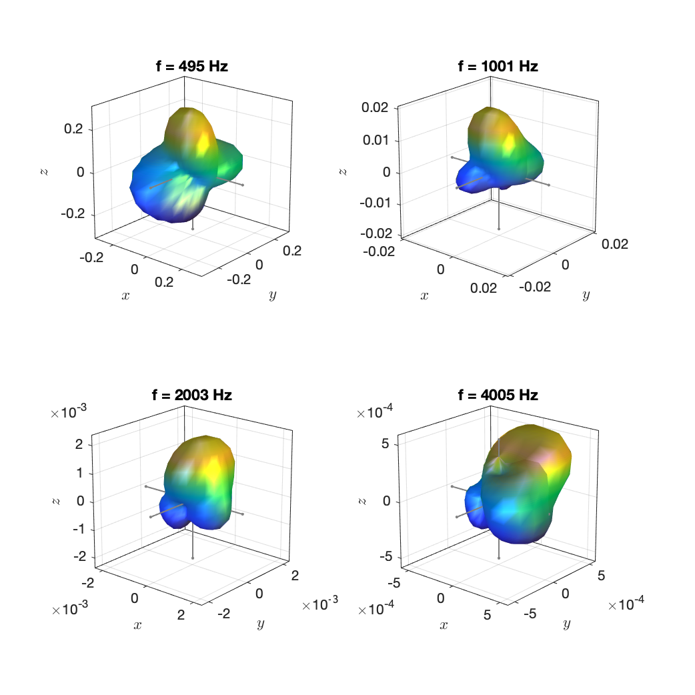
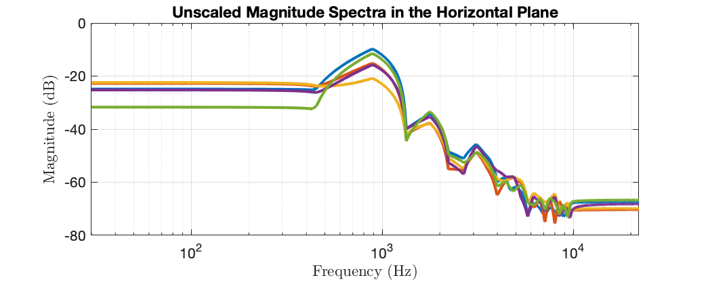

The data are taken from the measurements of 41 musical instruments in the [database by TUB and RWTH](http://dx.doi.org/10.14279/depositonce-5861.2) presented in this article:

> N. R. Shabtai, G. Behler, M. Vorländer, S. Weinzierl, "Generation and analysis of an acoustic radiation pattern database for forty-one musical instruments," J. Acoust. Soc. Am. 141, (2017)

We use the same file name tags like the original database. The instrument as well as the steadily played note and the dynamic based on which the directivity was computed can be deduced from the file names. "et" stands for "Einzelton", which is the German term for "single note". "ff" stands for fortissimo (very loud) and "pp" for pianissimo (very quite).

Example plots:

`Bassoon_modern_et_ff_a4_N4.mat`

