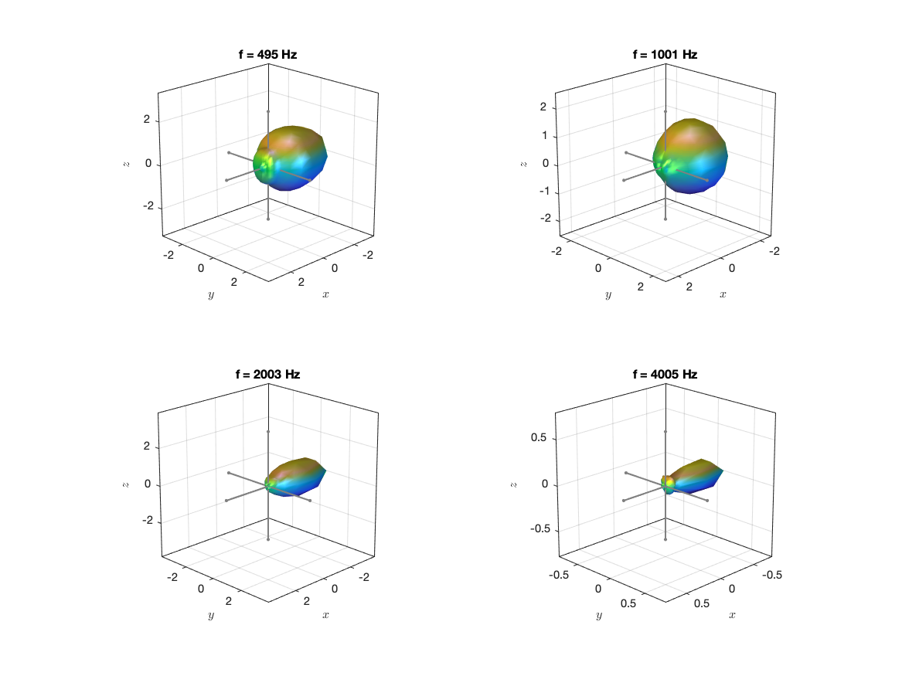
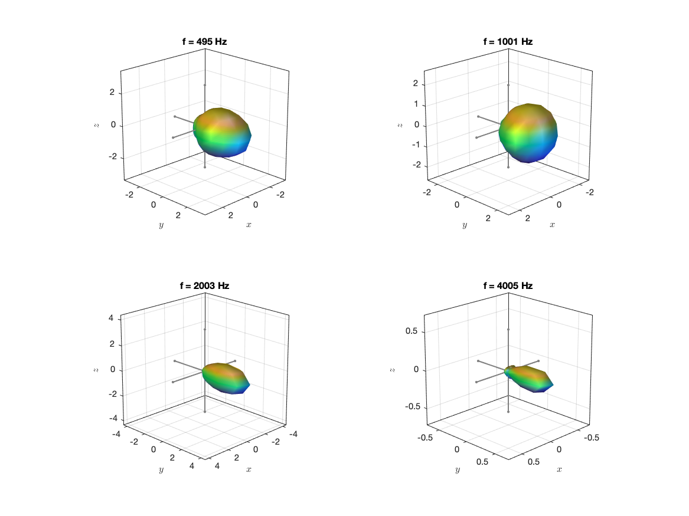
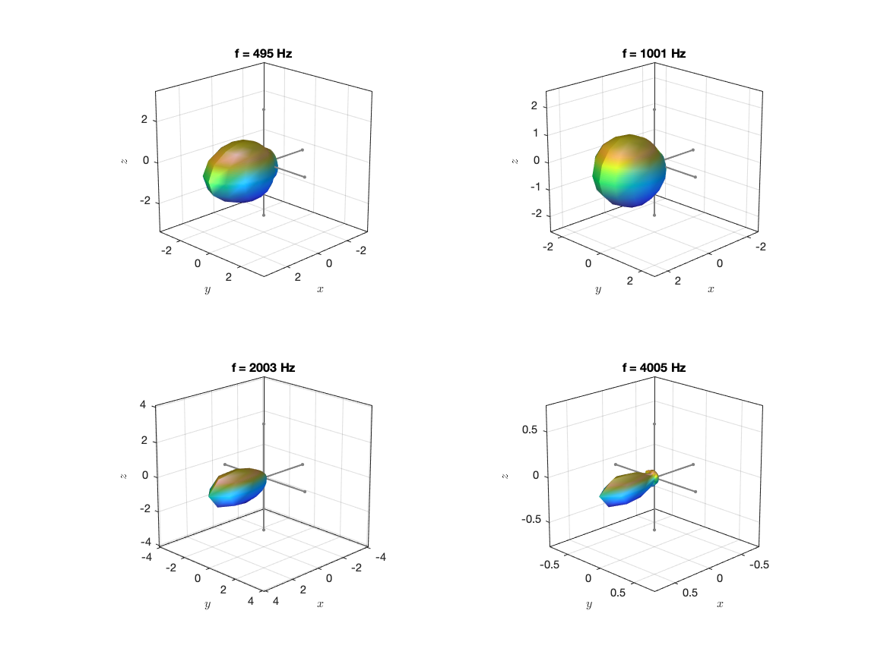

The data are the measurements of the 4 loudspeaker drivers of the IEM Loudspeaker Cube in the [DirPat database](https://opendata.iem.at/projects/dirpat/). All directivity models are far-field models based on third-octave smoothed magnitude data like in the Common Loudspeaker Format. The details are described in 

> J. Ahrens and S. Bilbao, “Interpolation and Range Extrapolation of Sound Source Directivity Based on a Spherical Wave Propagation Model,” in Proc. of IEEE ICASSP, Barcelona, Spain, May 2020

and particularly in

> J. Ahrens and S. Bilbao, “Computation of Spherical Harmonics Based Sound Source Directivity Models from Sparse Measurement Data,” Forum Acusticum, Lyon, France, May 2020.

Example balloon plots: 

`irs_DirPat_loudspeaker_cube_1_N6.mat`

`irs_DirPat_loudspeaker_cube_2_N6.mat`

`irs_DirPat_loudspeaker_cube_3_N6.mat`

`irs_DirPat_loudspeaker_cube_4_N6.mat`

