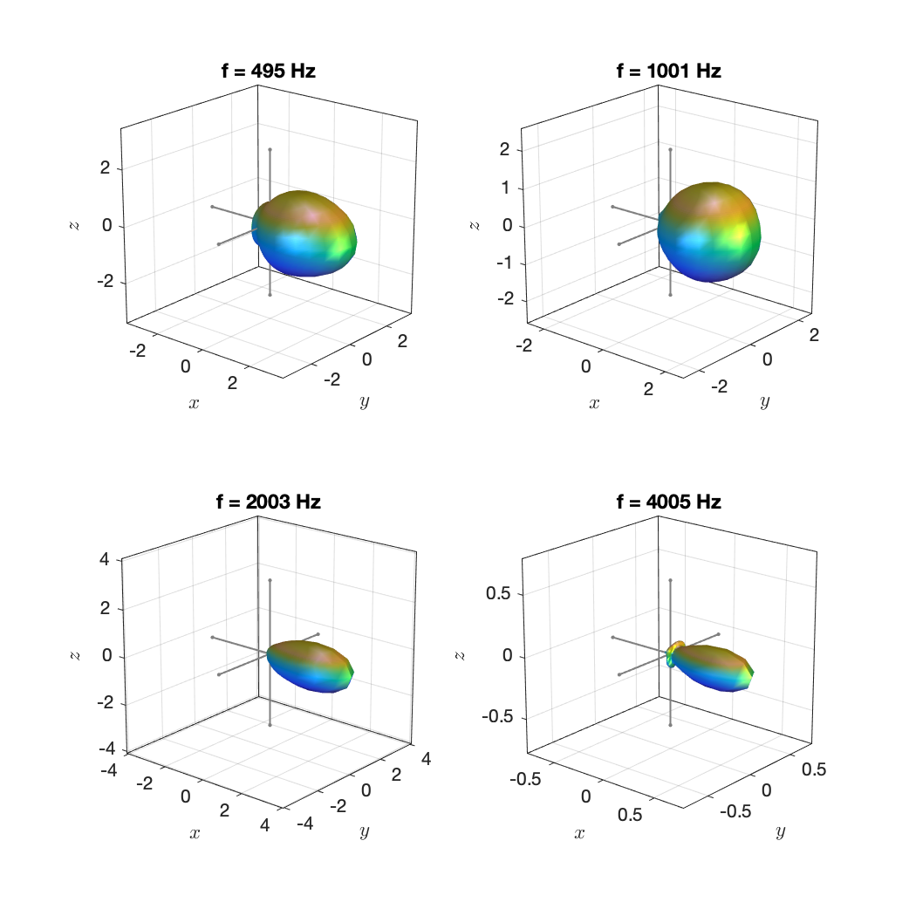

 This work is licensed under a <a rel="license" href="http://creativecommons.org/licenses/by-nc-sa/4.0/">Creative Commons Attribution-NonCommercial-ShareAlike 4.0 International License</a>.

# Database of Spherical Harmonic Representations of Sound Source Directivities

This is a database of complete spherical harmonic representations of the directivities of sound sources. The data are provided as impulse responses that represent the directivity of the given source in a given discrete direction. The Matlab script `compute_spherical_harmonics_model.m` demonstrates how a spherical harmonic representation can be computed from the data. 

We do not provide spherical harmonic coefficients directly because of the multitude of definitions of spherical harmonics and also of the Discrete Fourier transform. We rather ask you to select the combination of definitions you would like to use and compute the spherical harmonic coefficients on demand. You may want to add resampling or zero padding and the like to make the data compatible with your intended application. All data are bandlimited to the spherical harmonic order `N` that is specified in the corresponding file name. The conversion between raw data and spherical harmonic coefficients is therefore essentially lossless. 

All data are far-field representations as described in

> J. Ahrens and S. Bilbao, “Interpolation and Range Extrapolation of Sound Source Directivity Based on a Spherical Wave Propagation Model,” in Proc. of IEEE ICASSP, Barcelona, Spain, May 2020

and

> J. Ahrens and S. Bilbao, “Computation of Spherical Harmonics Based Sound Source Directivity Models from Sparse Measurement Data,” Forum Acusticum, Lyon, France, May 2020.

We will extend and update the data continuously.

Please cite this repository as follows:

> J. Ahrens (2020). Database of Spherical Harmonic Representations of Sound Source Directivities [Data set]. DOI: [10.5281/zenodo.3707708](https://doi.org/10.5281/ZENODO.3707708)

As of now, all spherical harmonic representations are based on previously published data. Please do not forget to cite the original repositories when using the data. References to the original sources are provided with each dataset. 
