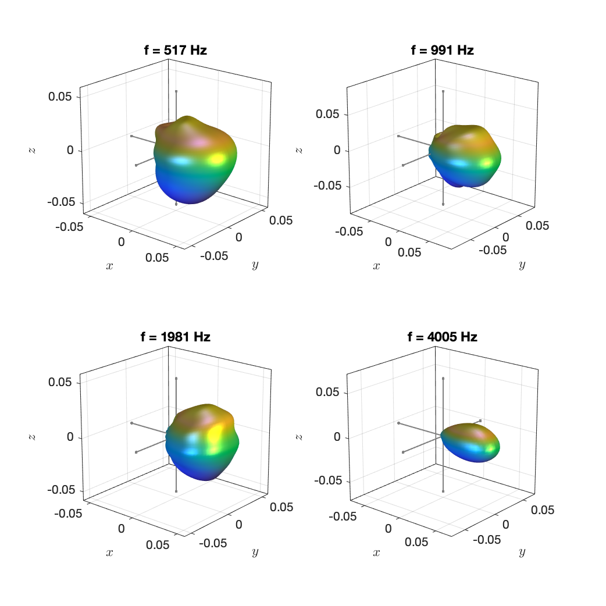

 This work is licensed under a <a rel="license" href="http://creativecommons.org/licenses/by-nc-sa/4.0/">Creative Commons Attribution-NonCommercial-ShareAlike 4.0 International License</a>.

# Database of Spherical Harmonic Representations of Sound Source Directivities

This is a database of complete spherical harmonic representations of the directivities of sound sources. The data are provided as impulse responses that represent the directivity of the given source in a given discrete direction. The Matlab script `compute_spherical_harmonic_representation.m` demonstrates how a spherical harmonic representation can be computed from the data.  

We do not provide spherical harmonic coefficients directly because of the multitude of definitions of spherical harmonics and also of the Discrete Fourier Transform. We rather ask you to select the combination of definitions you would like to use and compute the spherical harmonic coefficients on demand. You may want to add resampling or zero padding and the like to make the data compatible with your intended application. All data are bandlimited to the spherical harmonic order `N` that is specified in the corresponding file name. The conversion between the data at the support points and the spherical harmonic representation is therefore essentially lossless. 

**A word of warning:** All spherical harmonic representations are necessarily order limited. This means that they may deviate from the original measurement data from which they were computed. We do therefore not recommend to use our data for the analysis of the properties of the different directivities but rather use the original measured data from the original data sources wherever possible.

All data are based on the finite-distance signature, i.e., the magnitude directivity as observed on a spherical surface enclosing the source, as described in the publications that are listed at the bottom of this document. Currently, the directivities are not normalized to a given direction. Normalization is necessary if you want to employ recorded signals to drive the directivity as the recorded signal may already contain the directivity in the direction in which the signal was recorded. It is unclear at this stage how to normalize the directivity in the most favorable way for a given application. We will include such method as soon as it is available.

All directivities are causal meaning that they comprise a certain amount of silence in the time-domain representation that corresponds to the propagation delay from the source center to the measurement surface (plus a margin of 1 ms). The radius `R` of the measurement sphere is provided with the data. Most application will not need this, and you are free to remove it. Some applications like Ref. 4 do need it though. 

We will extend and update the data continuously.

Please cite this repository as follows:

> J. Ahrens (2020). Database of Spherical Harmonic Representations of Sound Source Directivities [Data set]. DOI: [10.5281/zenodo.3707708](https://doi.org/10.5281/ZENODO.3707708)

As of now, all spherical harmonic representations are based on previously published data. Please do not forget to cite the original repositories when using the data. References to the original sources are provided with each dataset. 

# References for the Computation Method

1. J. Ahrens and S. Bilbao, “Computation of Spherical Harmonic Representations of Source Directivity Based on the Finite-Distance Signature,” IEEE Transactions on Audio, Speech and Language Processing, 2020 (submitted)
2. J. Ahrens and S. Bilbao, “Interpolation and Range Extrapolation of Sound Source Directivity Based on a Spherical Wave Propagation Model,” in Proc. of IEEE ICASSP, Barcelona, Spain, May 2020 [ [pdf](http://www.soundfieldsynthesis.org/wp-content/uploads/pubs/AhrensBilbao_ICASSP2020.pdf) ]
3. J. Ahrens and S. Bilbao, “Computation of Spherical Harmonics Based Sound Source Directivity Models from Sparse Measurement Data,” Forum Acusticum, Lyon, France, May 2020.
4. S. Bilbao, J. Ahrens, and B. Hamilton,”Incorporating Source Directivity in Wave-based Virtual Acoustics: Time-domain Models and Fitting to  Measured Data,” in J. Acoust. Soc. Am. 146 (4), 2019

