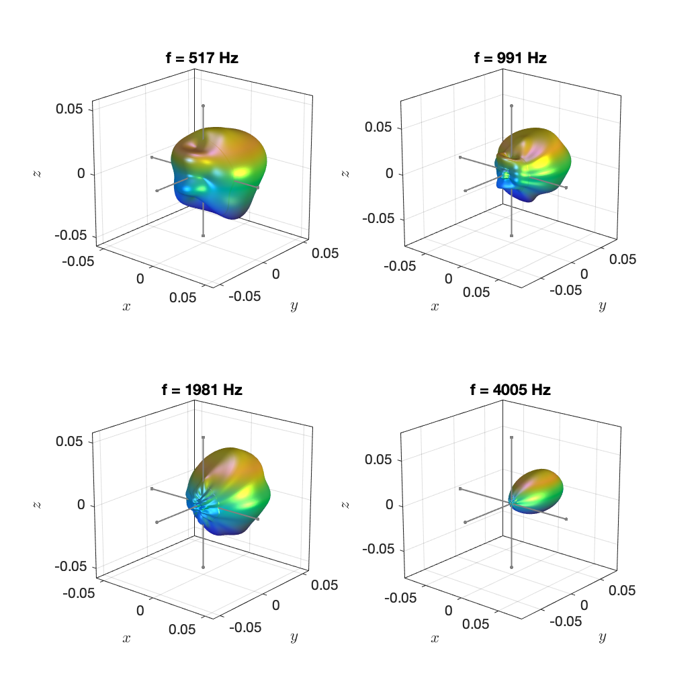
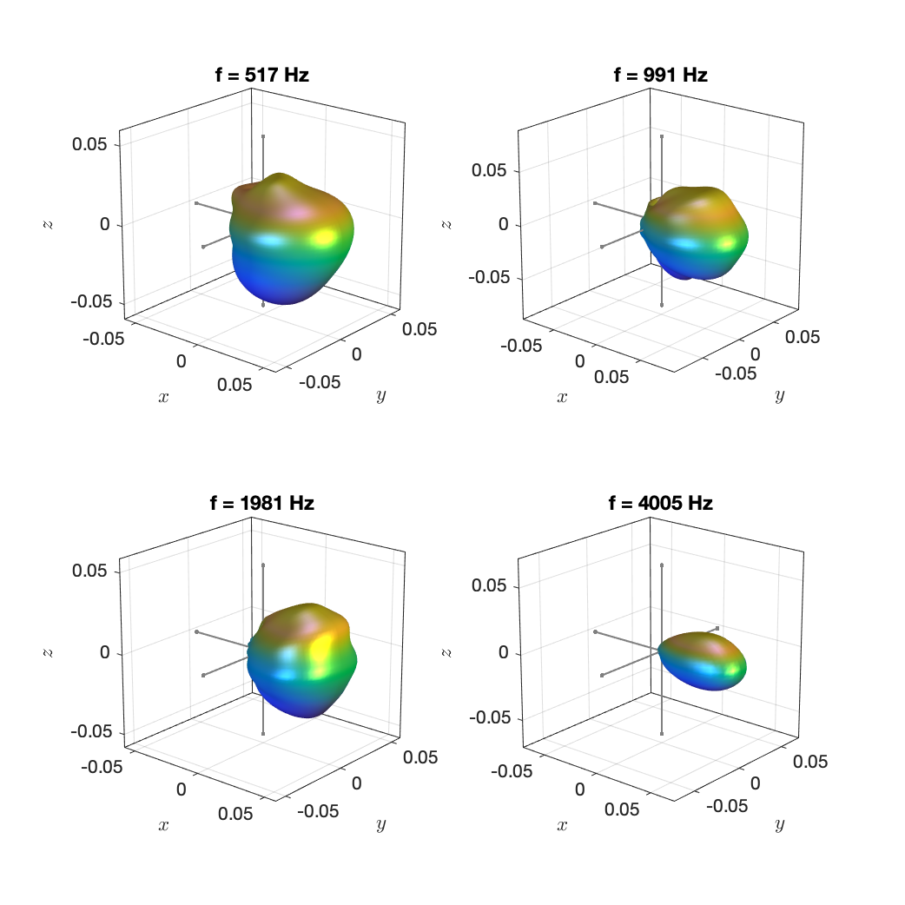

The data are the measurements of the 4 loudspeaker drivers of the IEM Loudspeaker Cube in the [DirPat database](https://opendata.iem.at/projects/dirpat/) presented in

> N. Meyer-Kahlen, F. Zotter, K. Pollack, “Design and Measurement of a First-Order, Horizontally Beam-Controlling Loudspeaker Cube,” in Proc. of 144th Conv. of the AES, e-Brief 447, 2018

We provide the original data along with our representation for convenience. Our representations are based on the finite-distance signature. We used the data in 

> J. Ahrens and S. Bilbao, “Computation of Spherical Harmonics Based Sound Source Directivity Models from Sparse Measurement Data,” Forum Acusticum, Lyon, France, May 2020.

Note that the data are of a rather high order of `N=17`. It might be useful to limit this in your application. This also automatically smooths the magnitude spectra some of which you see plotted below.

Example plots: 

`loudspeaker_cube_driver_1.mat`

`loudspeaker_cube_driver_2.mat`

`loudspeaker_cube_driver_3.mat`

`loudspeaker_cube_driver_4.mat`

