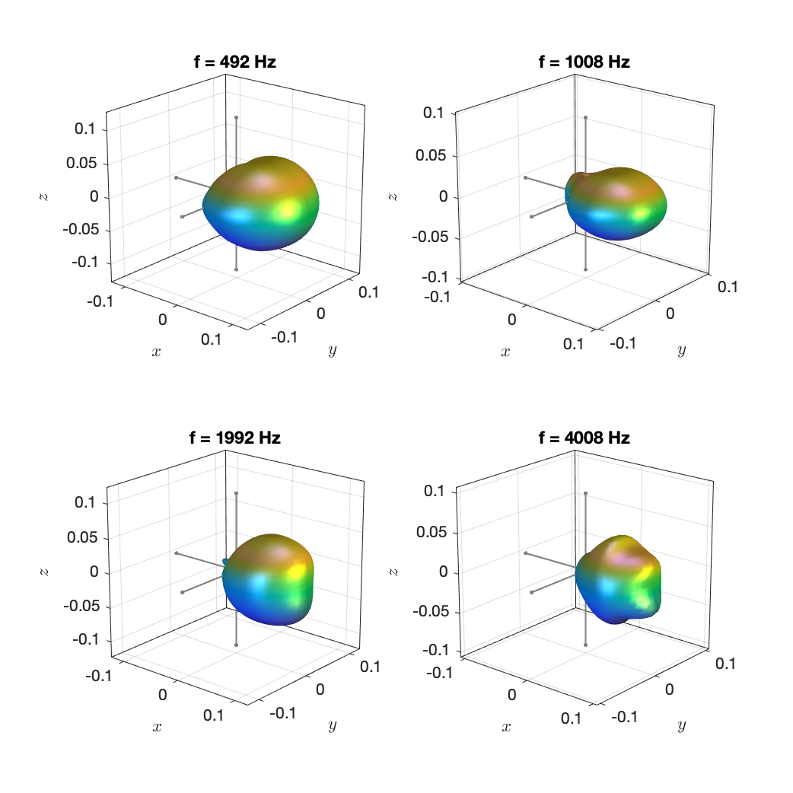
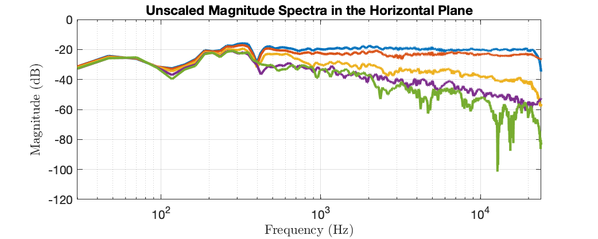

The data in this folder are based on the measurement data that are provided by the [3-D Audio & Applied Acoustics Lab](https://www.princeton.edu/3D3A/index.html) at Princeton University [here](https://www.princeton.edu/3D3A/Directivity.html). The data are licenced under a [Creative Commons Attribution 4.0 International License](http://creativecommons.org/licenses/by/4.0/). The following publications relate to them:

> R. Sridhar, J. G. Tylka, and E. Y. Choueiri. Generalized Metrics for Constant Directivity. *J. Audio Eng. Soc.*, 67(9), 666-678, 2019. 
>
> R. Sridhar, J. G. Tylka, and E. Y. Choueiri. Metrics for Constant Directivity. In *Audio Engineering Society Convention 140*, May 2016.
>
> J. G. Tylka, R. Sridhar, and E. Y. Choueiri. A Database of Loudspeaker Polar Radiation Measurements. In *Audio Engineering Society Convention 139*, October 2015.
>
> J. G. Tylka and E. Y. Choueiri. On the Calculation of Full and Partial Directivity Indices. Technical report #1, 3D Audio and Applied Acoustics Laboratory, Princeton University, November 2014. 

The measurements were taken over different segments of circular arcs in the horizontal and sagittal planes. The most comprehensive data sets cover a complete circle in either of the two planes, respectively, in steps of 5°. Most of the times, the geometry of the measured loudspeaker allowed for assuming certain symmertries to complement those segments of a circle that are not convered by the measurements. For some loudspeakers such as the *Essence Electrostatic Model 1600*, only horizontal data are available by no rotational symmetry may be assumed. We still assumed rotational symmetry about the main axis to compute a complete spherical harmonic representation. If data were available only for the frontal hemisphere, we did not assume symmetry but rather interpolated between the data points along the boundary between the hemispheres to obtain data for the rear side. We recommend that you visit the [illustrations of the original data](https://www.princeton.edu/3D3A/Directivity.html) to avoid misconceptions. 

The measurements were made at different distances between 0.7 m and 1.7 m (mostly at 1.5 m, 1.6 m, or 1.7 m). We always assumed a distance of 1.7 m for convenience. This affects only the amount of silence that appears at the beginning of the impulse response.

We resampled the data from 96 kHz to 48 kHz to reduce the data volume and the processing times. We computed the complete spherical harmonic representations by assuming as many symmetries as was necessary to obtain data on a complete circle in the horizontal and sagittal planes, respectively. We then interpolated the spectral magnitudes linearly over a complete spherical surface at a sufficient amount of support points. We then fitted a minimum phase to the magnitudes at the support points and performed an unregularized least-squares fit of spherical harmonic coefficients on the complex spectral data. 

Some of the loudspeakers appear exhibiting somewhat of a dipole-like directivity. Our minimum-phase representation suppresses the potential alternation of the sign that the directivity may exhibit in different directions. If it is important for you that the sign is reflected, then we recommend adding the sign change manually to the minimum-phase representation using, for example, 

​    `dataset.irs(:, dataset.azimuth > pi) = -dataset.irs(:, dataset.azimuth > pi);`

or similar.

The data are of a rather high order of `N=12`. It might be useful to limit this in your application. 

Example plots: 

`Genelec_8351A.mat`

