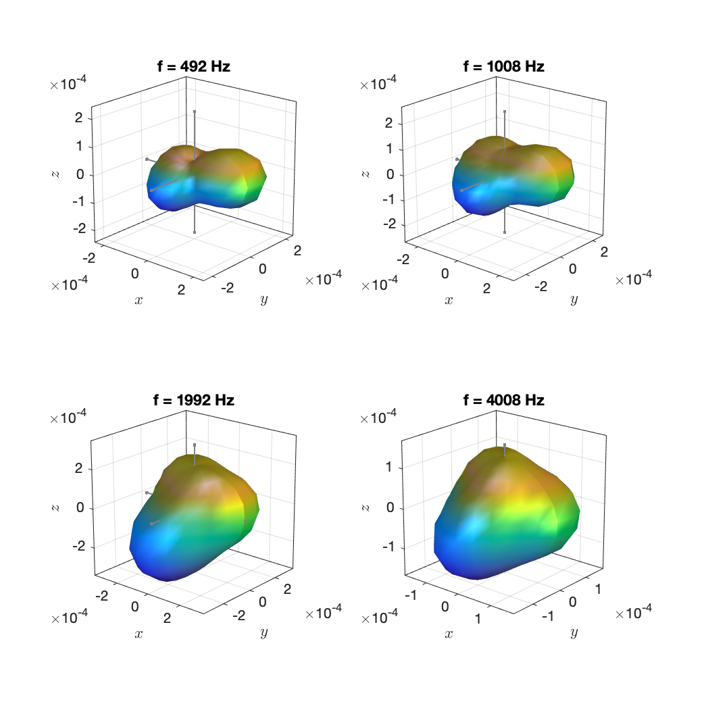

These data have been computed from the raw recordings of the database that was presented by the [Aalto Acoustics Lab](https://www.aalto.fi/en/aalto-acoustics-lab) in these articles:

> Jukka Pätynen, Ville Pulkki, and Tapio Lokki, "Anechoic Recording System for Symphony Orchestra," Acta Acustica utd. with Acustica Vol. 94 (2008), pp. 856–865

> Jukka Pätynen and Tapio Lokki, "Directivities of Symphony Orchestra Instruments," Acta Acustica utd. with Acustica Vol. 96 (2010), pp. 138–167

Special thanks go to Tapio Lokki for providing them! Note that the data are currently not available anywhere else.

Contrary to the pitched instruments, the directivity for the tamtam was deduced from 3rd-octave smoothed spectra. The dynamic, piano ("p", soft) or fortissimo ("ff", very loud), based on which the directivity was computed can be deduced from the file names.

All data are 3rd order.

Example plots:

`tamtam_ff.mat`

