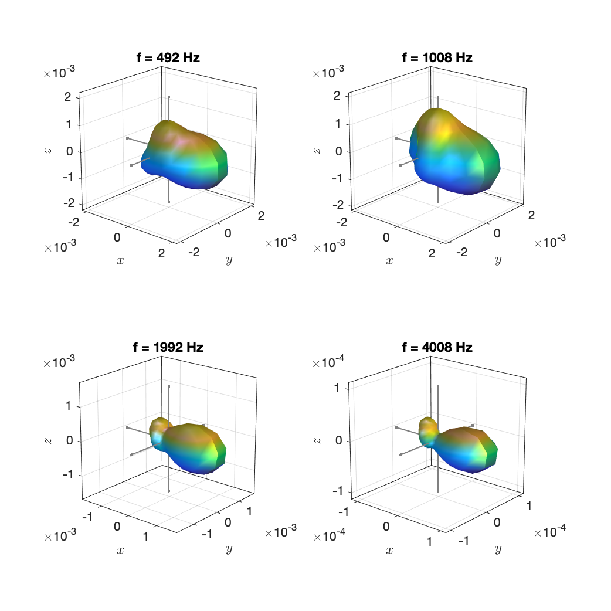

These data have been computed from the raw recordings of the database that was presented by the [Aalto Acoustics Lab](https://www.aalto.fi/en/aalto-acoustics-lab) in these articles:

> Jukka Pätynen, Ville Pulkki, and Tapio Lokki, "Anechoic Recording System for Symphony Orchestra," Acta Acustica utd. with Acustica Vol. 94 (2008), pp. 856–865

> Jukka Pätynen and Tapio Lokki, "Directivities of Symphony Orchestra Instruments," Acta Acustica utd. with Acustica Vol. 96 (2010), pp. 138–167

Special thanks go to Tapio Lokki for providing them! Note that the data are currently not available anywhere else.

The data do actually not correspond to the data that are depicted in the figures of (Pätynen & Lokki, 2010). This is because the figures were produced from 3rd-ocatave smoothed magnitude spectra of steady tones, which makes them incompatible with other databases. We chose to use the same approach that was applied in the [database by TUB and RWTH](http://dx.doi.org/10.14279/depositonce-5861.2): We deduced the directivity from the magnitudes of the stable partial oscillations and interpolated between these datapoints. The instrument as well as the steadily played note and the dynamic, piano ("p", soft), forte ("f", loud), or fortissimo ("ff", very loud), based on which the directivity was computed can be deduced from the file names. The character "k" in a note stands for "Kreuz", which is the German word for "sharp".

The directivity at frequencies below the fundamental oscillation of the played note is identical the directivity at the fundamental oscillation. Similarly, directivity at frequencies above 10 kHz is identical the directivity at the highest partial oscillation that we found below 10 kHz. This upper limit was 20 kHz for all notes with a fundamental frequency that is higher than 1 kHz.

All data are 3rd order.

Example plots:

`trumpet_a4_f.mat`

