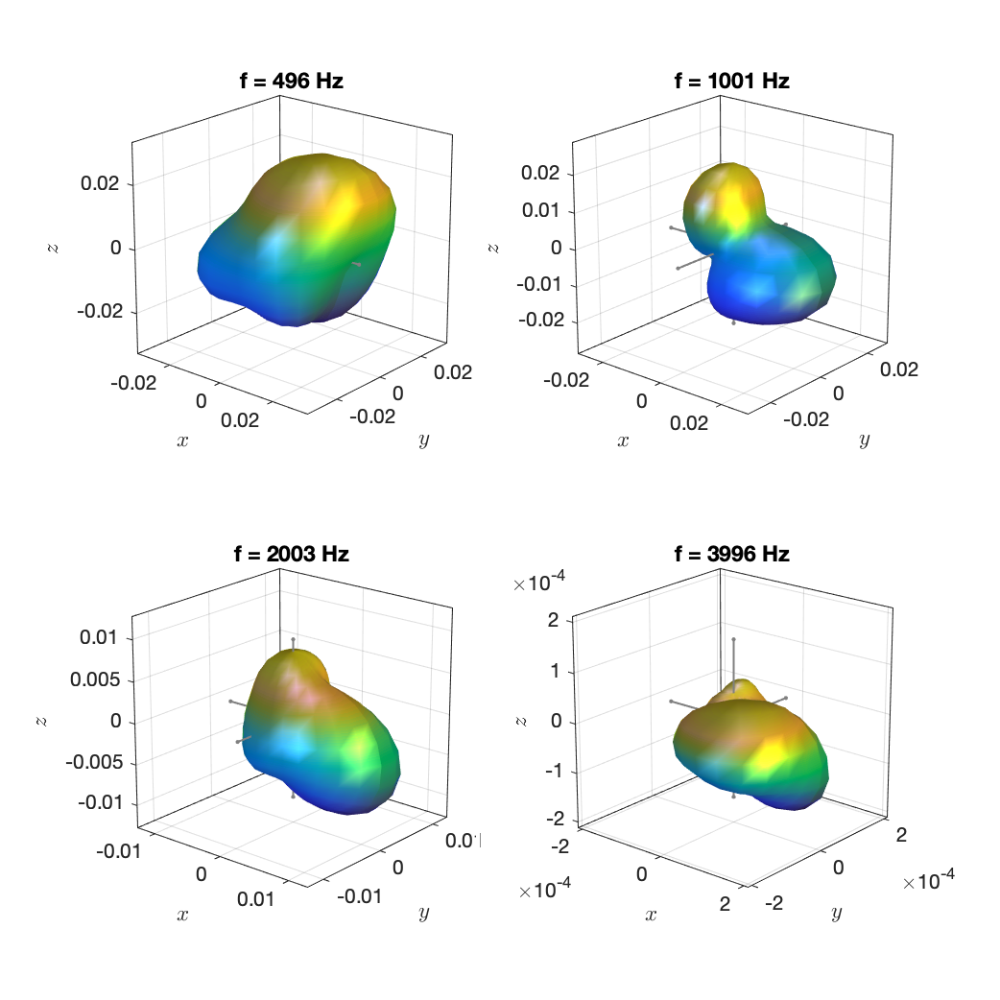
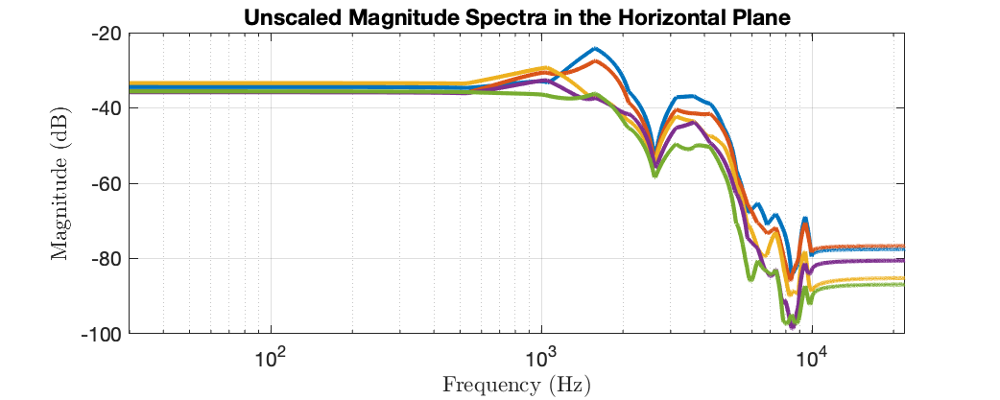

The data are taken from the measurements of 41 musical instruments in the [database by TUB and RWTH](http://dx.doi.org/10.14279/depositonce-5861.2 ). The instrument as well as the steadily played note based on which the directivity was computed can be deduced from the file names. The "Oboe modern" playing c5 is featured in this article:

> J. Ahrens and S. Bilbao, “Computation of Spherical Harmonic Representations of Source Directivity Based on the Finite-Distance Signature,” IEEE Transactions on Audio, Speech and Language Processing, 2020 (submitted)

Example plots: 

`irs_Oboe_modern_c5_N4.mat`

