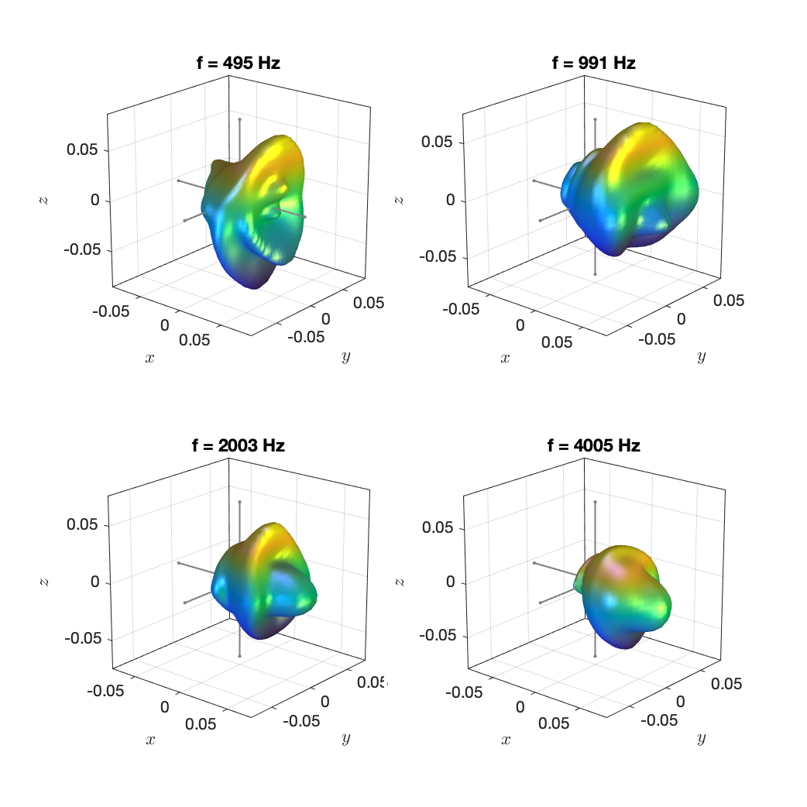

The data are the singing voice measurements from the [DirPat database](https://opendata.iem.at/projects/dirpat/), which were presented in

> M. Brandner, M. Frank, D. Rudrich, "DirPat - Database and Viewer of 2D/3D Directivity Patterns of Sound Sources and Receivers," in Proc. of 144th Conv. of the AES, e-Brief 425, 2018

Particularly, we used the data from these files:

* `IR_a_long_sweep.mat`

* `IR_a_closed_sweep.mat`

* `IR_a_open_sweep.mat`

* `IR_a_wide_sweep.mat`.

The calibration data in file `cal64.mat` were applied to all datasets. All directivity representations were computed similar to as it is described in 

> J. Ahrens and S. Bilbao, “Interpolation and Range Extrapolation of Sound Source Directivity Based on a Spherical Wave Propagation Model,” in Proc. of IEEE ICASSP, Barcelona, Spain, May 2020 [ [pdf](http://www.soundfieldsynthesis.org/wp-content/uploads/pubs/AhrensBilbao_ICASSP2020.pdf) ]

and

> J. Ahrens and S. Bilbao, “Computation of Spherical Harmonics Based Sound Source Directivity Models from Sparse Measurement Data,” Forum Acusticum, Lyon, France, May 2020.

with the difference that the present data are not referenced to a given direction. We applied a simple low-frequency extension below 120 Hz. Note that the data are of a rather high order of `N=12`. It might be useful to limit this in your application. 

Example plots: 

`singing_voice_a_closed_sweep_N12_non-reg.mat`

`singing_voice_a_closed_sweep_N12_reg.mat` 

`singing_voice_a_long_sweep_N12_non-reg.mat`

`singing_voice_a_long_sweep_N12_reg.mat` 

`singing_voice_a_open_sweep_N12_non-reg.mat`

`singing_voice_a_open_sweep_N12_reg.mat`

`singing_voice_a_wide_sweep_N12_non-reg.mat`

`singing_voice_a_wide_sweep_N12_reg.mat`

