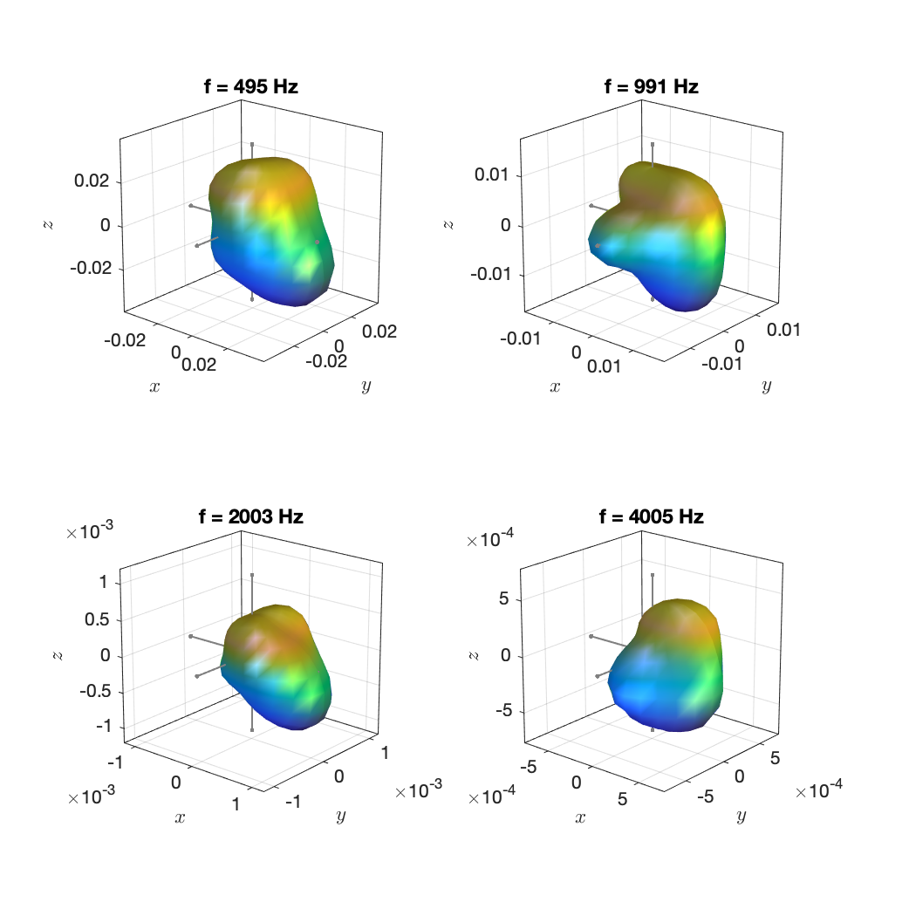
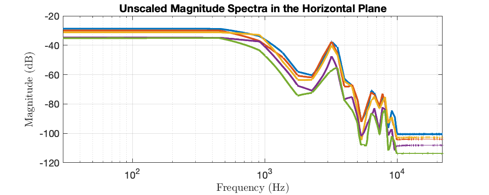

The data are the "Soprano_m" data from the [database by TUB and RWTH](http://dx.doi.org/10.14279/depositonce-5861.2) presented in this article:

> N. R. Shabtai, G. Behler, M. Vorländer, S. Weinzierl, "Generation and analysis of an acoustic radiation pattern database for forty-one musical instruments," J. Acoust. Soc. Am. 141, (2017)

We use the same file name tags like the original database. The steadily sung note and the dynamic based on which the directivity was computed can be deduced from the file names. "et" stands for "Einzelton", which is the German term for "single note". "ff" stands for fortissimo (very loud) and "pp" for pianissimo (very quiet). Admittedly, I don't know what the "m" in the file names stands for. The singer was singing a sound similar like "naaaahhhh".

The directivity at frequencies below the fundamental oscillation of the played note is identical the directivity at the fundamental oscillation. Similarly, directivity at frequencies above 10 kHz is identical the directivity at the highest partial oscillation that we found below 10 kHz.

All data are 4th order.

Note that there are many more different tones in the original database. [Contact us](http://www.ta.chalmers.se/people/jens-ahrens/) if you want us to process them for you.

Example plots:

`Soprano_m_et_ff_a4.mat`

