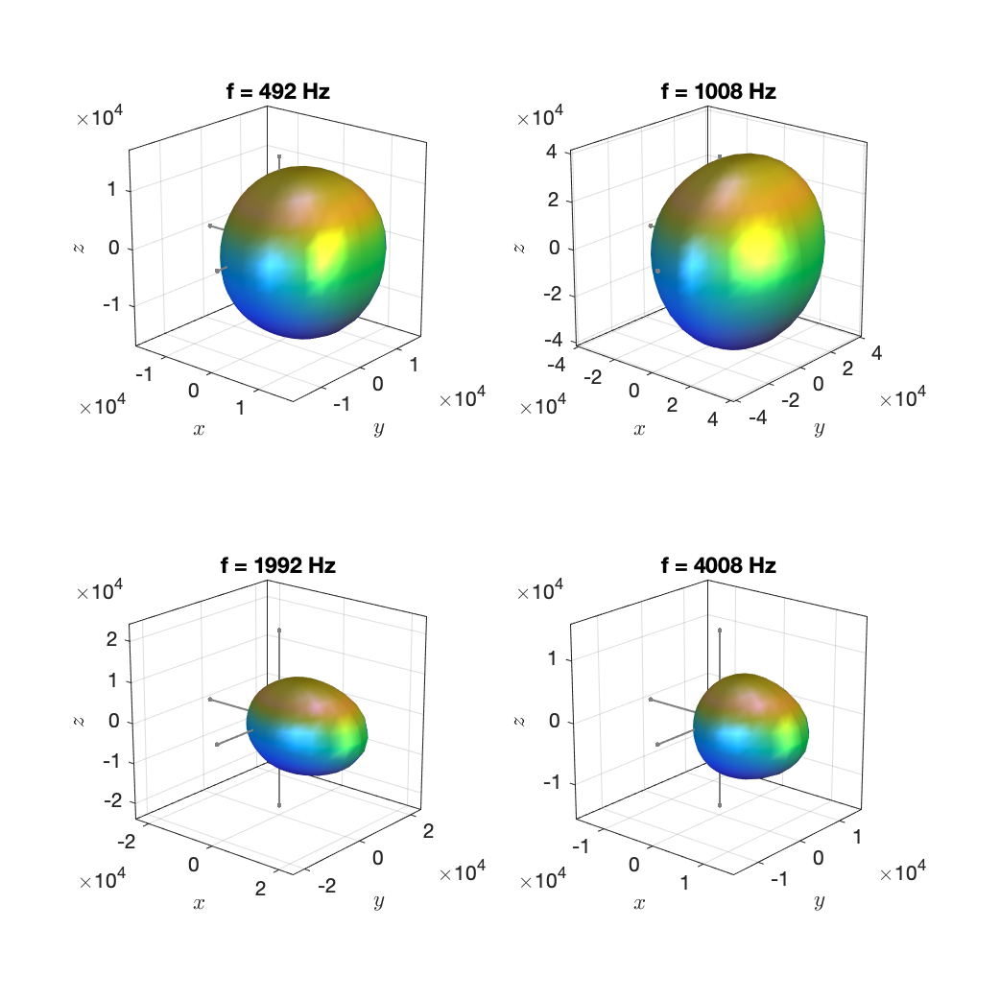

The data represent classical singers and were originally published in this article:

> Densil Cabrera, Pamela J. Davis, and Anna Connolly, "Long-Term Horizontal Vocal Directivity of Opera Singers: Effects of Singing Projection and Acoustic Environment," Journal of Voice, Vol. 25, No. 6, 2011

Special thanks go to [Densil Cabrera](https://www.sydney.edu.au/architecture/about/our-people/academic-staff/densil-cabrera.html) of The University of Sydney for providing us with them!

The data provided here are the octave-band data for the singers located in an anechoic chamber singing as they would in a large auditorium while not wearing any ear protection. The microphones were located at mouth height at azimuths [0°, -15°, 30°, -45°, 60°, -90°, 120°, -150°, 180°]. We assumed the directivity to exhibit perfect rotational symmetry with respect to the direction straight ahead (0° azimuth).

The data were obtained from averaging spectra of the microphone signals over the entire song rendition. For the male singers (no. 2 and 8), the directivity is assumed to be frequency independent - only direction dependent - below the lowest octave band (center frequency 125 Hz). For female singers (no. 1, 3, 4, 5, 6, 7), we assume frequency independence below the octave band with center frequency 250 Hz. 	

All data are 5th order.

Example plots:

`singer_1.mat`

